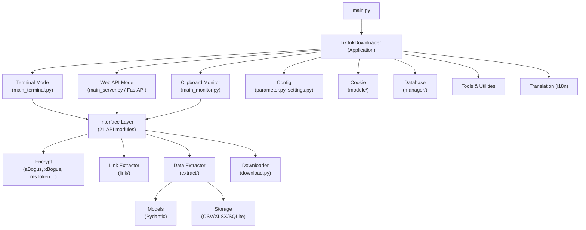

# TikTokDownloader (DouK-Downloader) — Project Overview

> **Version:** 5.8 · **Python:** 3.12 · **License:** GPL-3.0  
> **Author:** JoeanAmier · **Repo:** [github.com/JoeanAmier/TikTokDownloader](https://github.com/JoeanAmier/TikTokDownloader)

---

## 1. Tổng Quan

**DouK-Downloader** (tên cũ: TikTokDownloader) là công cụ **open-source** viết bằng Python, chuyên **thu thập dữ liệu** và **tải file** từ hai nền tảng **Douyin (抖音)** và **TikTok**. Toàn bộ giao tiếp mạng sử dụng thư viện async **HTTPX**, không dùng trình duyệt headless.

### Điểm nổi bật

| Khả năng | Mô tả |
|---|---|
| **Đa nền tảng** | Hỗ trợ cả Douyin (Trung Quốc) & TikTok (quốc tế) |
| **Đa chế độ** | Terminal CLI, Web API (FastAPI), Clipboard Monitor |
| **Async toàn bộ** | Xây dựng trên `asyncio`, HTTPX, aiofiles, aiosqlite |
| **Không cần trình duyệt** | Tự implement các thuật toán mã hóa (aBogus, xBogus, msToken…) |
| **Đa định dạng lưu trữ** | CSV, XLSX, SQLite, TXT |
| **Docker sẵn** | Dockerfile + Docker Hub image |
| **Đa ngôn ngữ** | i18n (zh_CN, en_US) |

---

## 2. Kiến Trúc Tổng Thể



---

## 3. Cấu Trúc Thư Mục `src/`

```
src/
├── application/       # Entry point & 3 chế độ chạy
│   ├── TikTokDownloader.py   # Lớp chính, menu, lifecycle
│   ├── main_terminal.py      # CLI mode (72KB - phức tạp nhất)
│   ├── main_server.py        # FastAPI Web API mode
│   └── main_monitor.py       # Clipboard monitoring mode
│
├── interface/         # 21 module API cho Douyin & TikTok
│   ├── template.py           # Base template cho tất cả API calls
│   ├── account.py / account_tiktok.py
│   ├── detail.py / detail_tiktok.py
│   ├── comment.py / comment_tiktok.py
│   ├── live.py / live_tiktok.py
│   ├── mix.py / mix_tiktok.py
│   ├── info.py / info_tiktok.py
│   ├── collection.py / collects.py
│   ├── search.py / hot.py / user.py
│   ├── hashtag.py / slides.py
│   └── __init__.py
│
├── config/            # Cấu hình & tham số
│   ├── parameter.py          # 41KB — quản lý toàn bộ params
│   └── settings.py           # Đọc/ghi settings.json
│
├── encrypt/           # Thuật toán mã hóa Douyin/TikTok
│   ├── aBogus.py             # Anti-bot signature
│   ├── xBogus.py             # Request signature
│   ├── xGnarly.py            # TikTok signature
│   ├── msToken.py            # Token generation
│   ├── verifyFp.py           # Fingerprint verification
│   ├── ttWid.py              # TikTok widget ID
│   ├── webID.py              # Web ID generation
│   └── device_id.py          # Device ID generation
│
├── extract/           # Trích xuất dữ liệu từ API response
│   └── extractor.py          # 52KB — parser chính
│
├── downloader/        # Download engine
│   └── download.py           # 30KB — multi-thread, resume
│
├── models/            # Pydantic models (request/response)
│   ├── settings.py / response.py
│   ├── account.py / detail.py / comment.py
│   ├── live.py / mix.py / search.py
│   ├── reply.py / share.py / base.py
│   └── __init__.py
│
├── storage/           # Lưu trữ dữ liệu đã thu thập
│   ├── manager.py            # Storage orchestrator
│   ├── csv.py / xlsx.py / sqlite.py / text.py
│   ├── sql.py / mysql.py (placeholder)
│   └── __init__.py
│
├── manager/           # Database & download records
│   └── (Database, DownloadRecorder)
│
├── record/            # Logging system
│   ├── base.py / logger.py
│   └── __init__.py
│
├── link/              # URL extraction & parsing
│   ├── extractor.py          # Trích URL Douyin/TikTok
│   └── requester.py          # Resolve short URLs
│
├── module/            # Cookie management & folder migration
│
├── tools/             # Utilities
│   ├── browser.py / console.py / cleaner.py
│   ├── retry.py / session.py / progress.py
│   ├── capture.py / timer.py / truncate.py
│   └── ...
│
├── custom/            # Constants & project-level config
│
├── translation/       # i18n (zh_CN ↔ en_US)
│
├── cli_edition/       # CLI-specific utilities
├── tui_edition/       # TUI (Terminal UI) edition
├── gui_edition/       # GUI edition (đang tái cấu trúc)
└── testers/           # Testing utilities
```

---

## 4. Ba Chế Độ Chạy

### 4.1 Terminal CLI Mode (`main_terminal.py`)
- **File lớn nhất** (72KB) — chứa toàn bộ logic tương tác terminal
- Menu phân cấp cho tất cả tính năng
- Hỗ trợ tải hàng loạt theo tài khoản, link, bộ sưu tập
- Tích hợp trực tiếp `ffmpeg` để thu livestream

### 4.2 Web API Mode (`main_server.py`)
- Chạy trên **FastAPI + Uvicorn** (mặc định `0.0.0.0:5555`)
- Tự động tạo docs tại `/docs` (Swagger) và `/redoc`
- Xác thực bằng **Token header**
- RESTful endpoints cho tất cả chức năng chính

### 4.3 Clipboard Monitor Mode (`main_monitor.py`)
- Tự động giám sát clipboard
- Khi phát hiện link Douyin/TikTok → tự động tải xuống
- Chạy nền, phù hợp dùng song song với trình duyệt

---

## 5. Tính Năng Chi Tiết

### 🎬 Tải Nội Dung

| Tính năng | Douyin | TikTok |
|---|:---:|:---:|
| Tải video (chất lượng cao nhất) | ✅ | ✅ |
| Tải bộ ảnh (image set) | ✅ | ✅ |
| Tải thực cảnh / ảnh động | ✅ | — |
| Tải ảnh bìa (tĩnh/động) | ✅ | ✅ |
| Tải hàng loạt bài đăng tài khoản | ✅ | ✅ |
| Tải hàng loạt bài thích | ✅ | ✅ |
| Tải bài đã lưu / bộ sưu tập lưu | ✅ | — |
| Tải hàng loạt bộ sưu tập (mix/collection) | ✅ | ✅ |
| Tải link đơn lẻ hoặc hàng loạt | ✅ | ✅ |

### 📡 Livestream

| Tính năng | Douyin | TikTok |
|---|:---:|:---:|
| Lấy link stream (pull URL) | ✅ | ✅ |
| Tải livestream qua `ffmpeg` | ✅ | ✅ |

### 📊 Thu Thập Dữ Liệu

| Tính năng | Douyin | TikTok |
|---|:---:|:---:|
| Dữ liệu chi tiết bài đăng | ✅ | ✅ |
| Thông tin tài khoản | ✅ | ✅ |
| Bình luận & phản hồi | ✅ | ✅ |
| Kết quả tìm kiếm (user/video/live) | ✅ | — |
| Bảng xếp hạng hot / trending | ✅ | — |
| Thống kê (like, share, comment count) | ✅ | ✅ |

### ⚙️ Tính Năng Nâng Cao

- **Tự động skip file đã tải** — theo record ID
- **Tải đa luồng** (multi-thread)
- **Hỗ trợ resume** (tải tiếp từ chỗ dừng)
- **Proxy** (HTTP/SOCKS5 qua HTTPX)
- **Lọc theo thời gian** phát hành
- **Tải tăng dần** (incremental) cho tài khoản
- **Tự động cập nhật nickname/ID** khi đổi
- **Giới hạn kích thước file**
- **Lưu theo thư mục** (folder mode)
- **Đọc Cookie từ clipboard hoặc trình duyệt** (Chrome, Edge, Firefox…)
- **Giao diện đa ngôn ngữ** (中文 / English)

---

## 6. Hệ Thống Mã Hóa (`encrypt/`)

Module quan trọng nhất để bypass anti-bot của Douyin/TikTok:

| Module | Mục đích |
|---|---|
| `aBogus.py` | Tạo tham số `a_bogus` — chống bot chính của Douyin |
| `xBogus.py` | Tạo tham số `X-Bogus` cho request |
| `xGnarly.py` | Signature cho TikTok API |
| `msToken.py` | Tạo `msToken` cho xác thực |
| `verifyFp.py` | Fingerprint trình duyệt giả lập |
| `ttWid.py` | TikTok widget ID |
| `webID.py` | Web session ID |
| `device_id.py` | Device ID generation |

---

## 7. Stack Công Nghệ

| Thành phần | Công nghệ |
|---|---|
| **Runtime** | Python 3.12, asyncio |
| **HTTP Client** | HTTPX (hỗ trợ SOCKS proxy) |
| **Web Framework** | FastAPI + Uvicorn |
| **Data Validation** | Pydantic v2 |
| **UI / Console** | Rich (terminal formatting) |
| **Storage** | aiosqlite, openpyxl, CSV built-in |
| **Crypto** | gmssl (SM3/SM4 — mã hóa Trung Quốc) |
| **File I/O** | aiofiles |
| **Cookie** | rookiepy (đọc từ trình duyệt), pyperclip |
| **Text Processing** | lxml, emoji |
| **Livestream** | ffmpeg (external) |
| **Linting** | Ruff |
| **Packaging** | uv, PyInstaller (via GitHub Actions) |
| **Deployment** | Docker |

---

## 8. Cách Chạy

```bash
# Clone
git clone https://github.com/JoeanAmier/TikTokDownloader.git
cd TikTokDownloader

# Cách 1: uv (khuyến nghị)
uv sync --no-dev
uv run main.py

# Cách 2: pip
python -m venv venv
venv\Scripts\activate
pip install -r requirements.txt
python main.py

# Cách 3: Docker
docker pull joeanamier/tiktok-downloader
docker run -p 5555:5555 -v tiktok_downloader_volume:/app/Volume -it joeanamier/tiktok-downloader
```

---

## 9. Ghi Chú

- Web UI mode đang **tạm đóng** — code đang được tái cấu trúc
- Tính năng quét QR code đăng nhập đã bị **vô hiệu hóa**
- Không hỗ trợ tải content **trả phí**
- Cần Cookie hợp lệ để tải video **chất lượng cao nhất**
- Trên Windows cần **quyền Admin** để đọc Cookie từ Chrome/Edge
