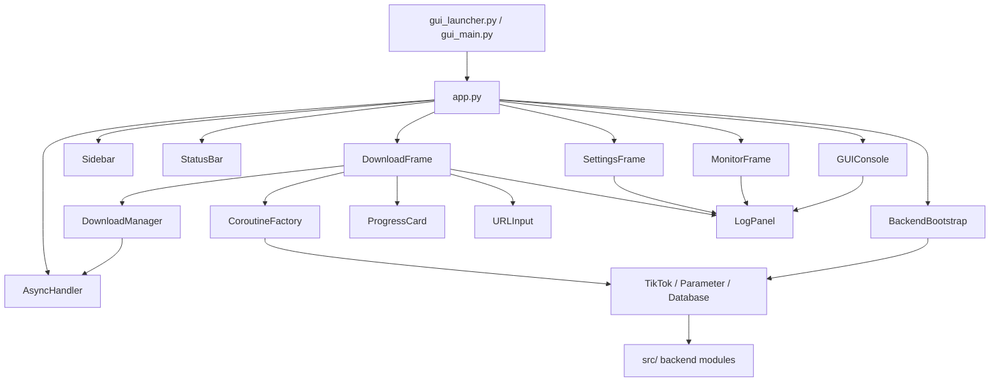

# Desktop App (CustomTkinter) — Project Structure

> **Mục đích:** Tài liệu chuẩn cấu trúc thư mục & module cho GUI Desktop.
> Mọi file mới phải tuân thủ cấu trúc này.
>
> **Cập nhật lần cuối:** 2026-03-24 — All 8 phases complete ✅

---

## Trạng thái tổng quan

| Phase | Nội dung | Status |
|-------|----------|--------|
| 1 | Foundation — async bridge, console adapter, deps | ✅ Done |
| 2 | Core UI Shell — window, sidebar, status bar, widgets, frames | ✅ Done |
| 3 | SettingsFrame — cookie, directory, proxy, format, toggles | ✅ Done |
| 4 | DownloadFrame P1 — Account/Link/Mix tabs + progress | ✅ Done |
| 5 | DownloadFrame P2 — Live/Collection/Data/Search tabs | ✅ Done |
| 6 | MonitorFrame — clipboard listener, queue, log | ✅ Done |
| 7 | Integration — backend bootstrap, coroutine wiring, error/about dialogs | ✅ Done |
| 8 | Packaging & Testing — PyInstaller spec, smoke tests, `--gui` flag | ✅ Done |

---

## Cây thư mục (thực tế)

```
src/gui_edition/
├── __init__.py              # Lazy export App (tránh cascading imports)
├── app.py                   # 🔑 MAIN — CTk window, sidebar nav, status bar, backend init
├── async_handler.py         # Thread-safe asyncio ↔ GUI bridge
├── backend_bootstrap.py     # Khởi tạo Database/Settings/Cookie/Parameter
├── console_adapter.py       # GUIConsole thay thế Rich ColorfulConsole
├── coroutine_factory.py     # 11 factory functions tạo backend coroutines
├── download_manager.py      # TaskInfo/TaskStatus/DownloadManager — job queue
├── gui_main.py              # Entry point: App().run()
├── theme.py                 # Bảng màu, font, spacing tokens (dark mode)
├── GUI_STRUCTURE.md          # ← File này
│
├── frames/                  # Các tab/page chính
│   ├── __init__.py          # Export 3 frames
│   ├── download_frame.py    # 7 tabs: Account/Link/Mix/Live/Collection/Data/Search (39KB)
│   ├── settings_frame.py    # 6 sections: Cookie/Directory/Format/Advanced/TextReplace/Records (43KB)
│   └── monitor_frame.py     # Clipboard listener + queue counters + log (12KB)
│
├── widgets/                 # Widget tái sử dụng
│   ├── __init__.py          # Export tất cả widgets
│   ├── about_dialog.py      # Dialog About — version, author, GitHub link
│   ├── error_dialog.py      # Modal hiển thị lỗi không block
│   ├── log_panel.py         # CTkTextbox + colour tags — nhận output từ GUIConsole
│   ├── progress_card.py     # Card hiển thị download progress + filename + speed
│   ├── sidebar.py           # Sidebar navigation buttons + logo + About button
│   ├── status_bar.py        # Cookie/FFmpeg indicators + message
│   └── url_input.py         # CTkEntry + paste button + validate
│
└── assets/                  # Tài nguyên tĩnh (placeholder)
    ├── icon.ico
    ├── icon.png
    └── logo.png

Root-level files:
├── gui_launcher.py          # PyInstaller entry point
├── gui.spec                 # PyInstaller one-dir windowed spec
└── tests/
    ├── test_gui_smoke.py    # 38 smoke tests (31 passed, 7 skipped)
    └── test_gui_launch.py   # Manual launch test (auto-destroy 10s)
```

**Tổng cộng:** 16 Python modules (10 core + 3 frames + 7 widgets + 2 `__init__`)

---

## Chi tiết modules

### Core (10 files)

| File | Lines | Vai trò |
|------|-------|---------|
| `app.py` | ~250 | CTk window 800×600, sidebar routing, backend init, shutdown |
| `async_handler.py` | ~70 | Background `asyncio` loop thread, `run_async(coro, on_done, on_error)` |
| `backend_bootstrap.py` | ~200 | Mirrors `TikTokDownloader.__init__` → `__aenter__` chain |
| `console_adapter.py` | ~100 | `GUIConsole` — drop-in replacement for `ColorfulConsole` |
| `coroutine_factory.py` | ~260 | 11 factory functions tạo backend download coroutines |
| `download_manager.py` | ~130 | `TaskInfo` dataclass, `TaskStatus` enum, `DownloadManager` queue |
| `gui_main.py` | ~25 | Entry point: `App().run()` |
| `theme.py` | ~90 | `COLORS`, `FONTS`, `SPACING`, `CORNER_RADIUS` tokens |
| `__init__.py` | ~8 | Lazy `__getattr__` export `App` |
| `GUI_STRUCTURE.md` | — | Tài liệu cấu trúc (file này) |

### Frames (3 files)

| File | Lines | Tabs / Sections |
|------|-------|-----------------|
| `download_frame.py` | ~1050 | **7 tabs:** Account, Link, Mix, Live, Collection, Data, Search |
| `settings_frame.py` | ~1150 | **6 sections:** Cookie, Directory/Format, Download toggles, Advanced, Text Replace, Records |
| `monitor_frame.py` | ~320 | Clipboard listener toggle, queue counters, embedded LogPanel |

### Widgets (7 files)

| File | Lines | Vai trò |
|------|-------|---------|
| `sidebar.py` | ~140 | 4 nav buttons (Download/Settings/Monitor/About) + logo |
| `log_panel.py` | ~120 | Scrollable text log, colour tags (INFO/WARNING/ERROR) |
| `progress_card.py` | ~140 | Download card: filename, %, speed, cancel button |
| `url_input.py` | ~130 | Multi-line text input, paste button, load .txt |
| `status_bar.py` | ~85 | Cookie Douyin/TikTok + FFmpeg indicators + message |
| `error_dialog.py` | ~95 | Themed modal dialog for errors |
| `about_dialog.py` | ~190 | Version, author, links, license info |

---

## Quy tắc thiết kế

### 1. Phân tách trách nhiệm

| Layer | Vai trò |
|-------|---------|
| `app.py` | Window lifecycle, sidebar routing, status bar, backend init/shutdown |
| `frames/` | UI layout cho từng tính năng, gọi backend qua `download_manager` |
| `widgets/` | Component nhỏ, tái sử dụng |
| `async_handler.py` | Bridge async ↔ Tk main thread |
| `console_adapter.py` | Redirect console output → LogPanel |
| `backend_bootstrap.py` | Khởi tạo Database/Settings/Cookie/Parameter |
| `coroutine_factory.py` | Tạo async callables cho download_manager.submit() |
| `download_manager.py` | Job queue, task lifecycle (QUEUED→RUNNING→DONE/ERROR/CANCELLED) |

### 2. Luồng async (bắt buộc)

```
[GUI thread]                    [Background asyncio loop]
    │                                    │
    ├─ user click "Download" ───────────►│
    │  → manager.submit(factory)         ├─ await factory(urls)
    │                                    ├─  → TikTok.detail_interactive()
    │                                    ├─  → Downloader.run()
    │◄── root.after(0, on_done) ────────┤
    ├─ update ProgressCard               │
    └─ enable button                     │
```

- **KHÔNG BAO GIỜ** gọi `await` trên GUI thread
- Luôn dùng `AsyncHandler.run_async(coro, on_done, on_error)`
- Callback `on_done`/`on_error` chạy trên GUI thread (safe để update widget)

### 3. Backend integration flow

```python
# app.py startup:
self.backend = BackendBootstrap(self.console)
self.ah.run_async(self.backend.start(), on_done=self._on_backend_ready)

# download_frame.py khi user click Start:
factory = coroutine_factory.make_link_factory(backend, platform)
manager.submit("link", platform, urls, backend_coro_factory=factory)

# coroutine_factory.py:
def make_link_factory(backend, platform):
    async def _factory(urls):
        tiktok = TikTok(backend.parameter, backend.database)
        await tiktok.detail_interactive(urls)
    return _factory
```

### 4. Theme (Dark Mode mặc định)

```python
COLORS = {
    "bg_primary":    "#1a1a2e",   # Nền chính
    "bg_secondary":  "#16213e",   # Sidebar / card
    "bg_card":       "#0f3460",   # Card nổi
    "accent":        "#e94560",   # Nút chính, active state
    "text_primary":  "#ffffff",
    "text_secondary":"#a0a0a0",
    "success":       "#00e676",
    "warning":       "#ffd600",
    "error":         "#ff1744",
    "info":          "#40c4ff",
}
```

### 5. Naming conventions

- File: `snake_case.py`
- Class: `PascalCase` (`DownloadFrame`, `ProgressCard`)
- Widget attribute: `self._widget_name` (private prefix)
- Callback: `self._on_event_name()` hoặc `self._handle_action()`
- Async bridge: `self._start_xxx()` → `handler.run_async()`

### 6. Entry points

```bash
# Từ main.py (có --gui flag):
python main.py --gui

# Trực tiếp:
python -m src.gui_edition.gui_main

# PyInstaller:
pyinstaller gui.spec
```

---

## Dependency map



---

## Danh sách tính năng — Trạng thái hoàn thành

> Ký hiệu: ✅ = đã implement, 🟡 = deferred/partial

### A. Main Menu — Từ `TikTokDownloader` class

| # | Tính năng | GUI Location | Status |
|---|-----------|-------------|--------|
| 1 | Cookie Douyin từ clipboard | SettingsFrame Section 1 | ✅ |
| 2 | Cookie Douyin từ browser | SettingsFrame Section 1 (rookiepy) | ✅ |
| 3 | Cookie TikTok từ clipboard | SettingsFrame Section 1 | ✅ |
| 4 | Cookie TikTok từ browser | SettingsFrame Section 1 (rookiepy) | ✅ |
| 5 | Terminal interactive mode | DownloadFrame (7 tabs) | ✅ |
| 6 | Monitor clipboard | MonitorFrame | ✅ |
| 7 | Web API server | — | 🟡 Deferred (chạy riêng) |
| 8 | Web UI mode | — | — Không áp dụng |
| 9 | Toggle ghi log record | SettingsFrame Section 3 | ✅ |
| 10 | Xóa download record | SettingsFrame Section 6 | ✅ |
| 11 | Toggle ghi log file | SettingsFrame Section 3 | ✅ |
| 12 | Check update | SettingsFrame | 🟡 Deferred |
| 13 | Chuyển ngôn ngữ | — | 🟡 Deferred (backend i18n phức tạp) |

### B. Download Modes — 11 Douyin + 4 TikTok + 4 Search

| Mode | Tab | Platform | Coroutine Factory | Status |
|------|-----|----------|------------------|--------|
| Account batch | Account | Douyin+TikTok | `make_account_factory` | ✅ |
| Link download | Link | Douyin+TikTok | `make_link_factory` | ✅ |
| Mix/Collection | Mix | Douyin+TikTok | `make_mix_factory` | ✅ |
| Live stream | Live | Douyin+TikTok | `make_live_factory` | ✅ |
| Comment data | Data | Douyin | `make_comment_factory` | ✅ |
| User data | Data | Douyin | `make_user_factory` | ✅ |
| Hot/Trending | Data | Douyin | `make_hot_factory` | ✅ |
| Collection (saved) | Collection | Douyin | `make_collection_factory` | ✅ |
| Collects (folders) | Collection | Douyin | `make_collects_factory` | ✅ |
| Collection music | Collection | Douyin | `make_collection_music_factory` | ✅ |
| Search General | Search | Douyin | `make_search_factory` | ✅ |
| Search Video | Search | Douyin | `make_search_factory` | ✅ |
| Search User | Search | Douyin | `make_search_factory` | ✅ |
| Search Live | Search | Douyin | `make_search_factory` | ✅ |

### C. Monitor Mode

| Tính năng | GUI Widget | Status |
|-----------|-----------|--------|
| Clipboard listener ON/OFF | MonitorFrame toggle button | ✅ |
| Auto-detect Douyin/TikTok links | Keyword match in clipboard | ✅ |
| Queue counters (Douyin/TikTok/Total) | MonitorFrame labels | ✅ |
| Log processed links | Embedded LogPanel | ✅ |
| Stop button | MonitorFrame button (replaces "close" trick) | ✅ |
| Clear Log + Reset Counters | MonitorFrame buttons | ✅ |

### D. Settings / Configuration

| Tính năng | GUI Location | Status |
|-----------|-------------|--------|
| Thư mục lưu file | SettingsFrame Section 2 (folder picker) | ✅ |
| Storage format (CSV/XLSX) | SettingsFrame Section 2 (dropdown) | ✅ |
| Platform toggles (Douyin/TikTok) | SettingsFrame Section 2 | ✅ |
| Proxy HTTP (Douyin + TikTok) | SettingsFrame Section 2 | ✅ |
| Name format template | SettingsFrame Section 2 | ✅ |
| Date format / split char | SettingsFrame Section 2 | ✅ |
| Folder mode | SettingsFrame Section 2 | ✅ |
| Chunk size / timeout / retry / pages | SettingsFrame Section 4 | ✅ |
| Download type / music / cover toggles | SettingsFrame Section 3 | ✅ |
| FFmpeg path / live qualities | SettingsFrame Section 4 | ✅ |
| Desc/name length / truncate | SettingsFrame Section 4 | ✅ |
| Text replacement rules | SettingsFrame Section 5 | ✅ |
| Cookie state indicators | StatusBar (green/red) | ✅ |
| FFmpeg indicator | StatusBar | ✅ |
| Save / Reset buttons | SettingsFrame | ✅ |
| Periodic cookie refresh | BackendBootstrap daemon thread | ✅ |

### E. Extras

| Tính năng | Location | Status |
|-----------|----------|--------|
| Error dialog | `widgets/error_dialog.py` | ✅ |
| About dialog | `widgets/about_dialog.py` (via sidebar ℹ️) | ✅ |
| `--gui` flag in `main.py` | `main.py` argparse | ✅ |
| PyInstaller spec | `gui.spec` | ✅ |
| Smoke tests (38 tests) | `tests/test_gui_smoke.py` | ✅ |
| _UnavailableOverlay for Douyin-only tabs | DownloadFrame | ✅ |

---

## Checklist tạo file mới

- [ ] File nằm trong đúng thư mục theo cây ở trên?
- [ ] Import tuyệt đối từ `src.` (không relative ngoài package)?
- [ ] Async operation dùng `AsyncHandler.run_async()`?
- [ ] Console output qua `GUIConsole` (không dùng `print()` / Rich)?
- [ ] Màu sắc lấy từ `theme.py` (không hardcode)?
- [ ] Widget có `destroy()` / cleanup nếu cần?
- [ ] Test có trong `test_gui_smoke.py`?
