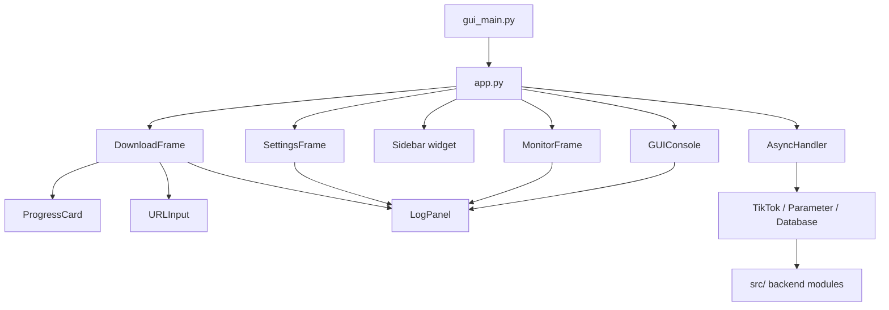

# Desktop App (CustomTkinter) — Project Structure

> **Mục đích:** Tài liệu chuẩn cấu trúc thư mục & module cho GUI Desktop.
> Mọi file mới phải tuân thủ cấu trúc này.

---

## Cây thư mục

```
src/gui_edition/
├── __init__.py              # Export App class
├── app.py                   # 🔑 MAIN — CTk window, sidebar nav, status bar
├── async_handler.py         # Thread-safe asyncio ↔ GUI bridge
├── console_adapter.py       # GUIConsole thay thế Rich ColorfulConsole
├── theme.py                 # Bảng màu, font, spacing tokens (dark mode)
│
├── frames/                  # Các tab/page chính
│   ├── __init__.py
│   ├── download_frame.py    # Tab Download — URL input, batch, progress bars
│   ├── settings_frame.py    # Tab Settings — thư mục lưu, proxy, cookie, format
│   └── monitor_frame.py     # Tab Monitor  — clipboard monitor ON/OFF + log
│
├── widgets/                 # Widget tái sử dụng
│   ├── __init__.py
│   ├── log_panel.py         # CTkTextbox + colour tags — nhận output từ GUIConsole
│   ├── progress_card.py     # Card hiển thị download progress + filename + speed
│   ├── url_input.py         # CTkEntry + paste button + validate
│   └── sidebar.py           # Sidebar navigation buttons + logo
│
└── assets/                  # Tài nguyên tĩnh
    ├── icon.ico             # App icon cho Windows
    ├── icon.png             # App icon cho macOS/Linux
    └── logo.png             # Logo hiển thị trên sidebar
```

---

## Quy tắc thiết kế

### 1. Phân tách trách nhiệm

| Layer | Vai trò | Ví dụ |
|---|---|---|
| **app.py** | Window lifecycle, sidebar routing, status bar | `App.run()`, `App._switch_frame()` |
| **frames/** | UI layout cho từng tính năng, gọi async operations | `DownloadFrame._start_download()` |
| **widgets/** | Component nhỏ, tái sử dụng, stateless | `ProgressCard.update(percent, speed)` |
| **async_handler.py** | Bridge async ↔ Tk main thread | `handler.run_async(coro, on_done)` |
| **console_adapter.py** | Redirect console output → LogPanel | `GUIConsole.info("Done")` |

### 2. Luồng async (bắt buộc)

```
[GUI thread]                    [Background asyncio loop]
    │                                    │
    ├─ user click "Download" ───────────►│
    │                                    ├─ await TikTok.detail_interactive()
    │                                    ├─ await Downloader.run()
    │◄── root.after(0, on_done) ────────┤
    ├─ update ProgressCard               │
    └─ enable button                     │
```

- **KHÔNG BAO GIỜ** gọi `await` trên GUI thread
- Luôn dùng `AsyncHandler.run_async(coro, on_done, on_error)`
- Callback `on_done`/`on_error` chạy trên GUI thread (safe để update widget)

### 3. Tương tác với backend hiện tại

```python
# app.py khởi tạo backend giống TikTokDownloader.__init__()
self.database = Database()
await self.database.__aenter__()

self.settings = Settings(PROJECT_ROOT, self.gui_console)
self.cookie = Cookie(self.settings, self.gui_console)

# Tạo Parameter
self.parameter = Parameter(
    self.settings,
    self.cookie,
    logger=logger,
    console=self.gui_console,  # <-- GUIConsole thay ColorfulConsole
    **self.settings.read(),
    recorder=recorder,
)

# Dùng TikTok class cho logic
self.tiktok = TikTok(self.parameter, self.database)
```

### 4. Theme (Dark Mode mặc định)

```python
# theme.py
COLORS = {
    "bg_primary":    "#1a1a2e",   # Nền chính
    "bg_secondary":  "#16213e",   # Sidebar / card
    "bg_card":       "#0f3460",   # Card nổi
    "accent":        "#e94560",   # Nút chính, active state
    "text_primary":  "#ffffff",
    "text_secondary":"#a0a0a0",
    "success":       "#00e676",
    "warning":       "#ffd600",
    "error":         "#ff1744",
    "info":          "#40c4ff",
}
FONT_FAMILY = "Segoe UI"       # Windows; fallback Helvetica
FONT_SIZE_NORMAL = 13
FONT_SIZE_TITLE  = 18
CORNER_RADIUS    = 10
```

### 5. Naming conventions

- File: `snake_case.py`
- Class: `PascalCase` (ví dụ `DownloadFrame`, `ProgressCard`)
- Widget ID / attribute: `self._widget_name` (private prefix)
- Callback: `self._on_event_name()` hoặc `self._handle_action()`
- Async bridge: `self._start_xxx()` gọi `handler.run_async()`

### 6. Entry point

```python
# gui_main.py (root project)
from src.gui_edition import App

if __name__ == "__main__":
    app = App()
    app.run()
```

---

## Dependency map



---

## Checklist tạo file mới

- [ ] File nằm trong đúng thư mục theo cây ở trên?
- [ ] Import tuyệt đối từ `src.` (không relative ngoài package)?
- [ ] Async operation dùng `AsyncHandler.run_async()`?
- [ ] Console output qua `GUIConsole` (không dùng `print()` / Rich)?
- [ ] Màu sắc lấy từ `theme.py` (không hardcode)?
- [ ] Widget có `destroy()` / cleanup nếu cần?

---

## Danh sách tính năng cần convert sang Desktop App

> Nguồn: `TikTokDownloader.py` (Main Menu), `main_terminal.py` (Interactive Mode), `main_monitor.py` (Monitor Mode)
> 
> **Ký hiệu:** P1 = ưu tiên cao (MVP), P2 = quan trọng, P3 = có thì tốt

### A. Main Menu — `TikTokDownloader` class

| # | Tính năng (CLI) | Method | GUI Frame | Priority |
|---|---|---|---|---|
| 1 | Đọc Cookie từ clipboard (Douyin) | `write_cookie()` | `SettingsFrame` — nút "Paste Cookie Douyin" | P1 |
| 2 | Đọc Cookie từ browser (Douyin) | `browser_cookie()` | `SettingsFrame` — dropdown chọn browser + nút Import | P1 |
| 3 | Đọc Cookie từ clipboard (TikTok) | `write_cookie_tiktok()` | `SettingsFrame` — nút "Paste Cookie TikTok" | P1 |
| 4 | Đọc Cookie từ browser (TikTok) | `browser_cookie_tiktok()` | `SettingsFrame` — dropdown chọn browser + nút Import | P1 |
| 5 | Chế độ Terminal tương tác | `complete()` → `TikTok.run()` | `DownloadFrame` — tất cả sub-features bên dưới | P1 |
| 6 | Chế độ Monitor clipboard | `monitor()` | `MonitorFrame` — toggle ON/OFF + log | P1 |
| 7 | Chế độ Web API server | `server()` | `SettingsFrame` — nút Start/Stop API server | P3 |
| 8 | Web UI mode (disabled) | `disable_function()` | — Bỏ qua (chưa implement ở CLI) | — |
| 9 | Bật/tắt ghi log download record | `__modify_record()` | `SettingsFrame` — toggle switch | P2 |
| 10 | Xóa download record | `delete_works_ids()` | `SettingsFrame` — input ID + nút Delete | P3 |
| 11 | Bật/tắt ghi log file | `__modify_logging()` | `SettingsFrame` — toggle switch | P2 |
| 12 | Kiểm tra update phiên bản | `check_update()` | `SettingsFrame` hoặc About dialog | P2 |
| 13 | Chuyển ngôn ngữ (zh_CN ↔ en_US) | `_switch_language()` | `SettingsFrame` — dropdown Language | P1 |

### B. Terminal Interactive Mode — `TikTok` class (15 tính năng chính)

#### B1. Douyin (抖音) — 10 tính năng

| # | Tính năng | Method | Input mode | GUI Widget | Priority |
|---|---|---|---|---|---|
| 1 | Batch download tác phẩm theo tài khoản | `account_acquisition_interactive()` | URL accounts / nhập tay / file .txt | `DownloadFrame` — tab "Account" | P1 |
| 2 | Download tác phẩm theo link | `detail_interactive()` | Nhập link / file .txt | `DownloadFrame` — tab "Link" | P1 |
| 3 | Lấy địa chỉ livestream | `live_interactive()` | Nhập link live | `DownloadFrame` — tab "Live" | P2 |
| 4 | Thu thập dữ liệu comment | `comment_interactive()` | Nhập link / file .txt | `DownloadFrame` — tab "Data" | P2 |
| 5 | Batch download tác phẩm theo hợp tuyển (Mix) | `mix_interactive()` | URL mix / collection list / nhập tay / file .txt | `DownloadFrame` — tab "Mix" | P1 |
| 6 | Thu thập dữ liệu chi tiết tài khoản | `user_interactive()` | URL accounts / nhập tay / file .txt | `DownloadFrame` — tab "Data" | P2 |
| 7 | Thu thập dữ liệu tìm kiếm | `search_interactive()` | Nhập keyword | `DownloadFrame` — tab "Search" | P2 |
| 8 | Thu thập dữ liệu Hot/Trending | `hot_interactive()` | Không cần input | `DownloadFrame` — tab "Data" | P3 |
| 9 | Batch download tác phẩm yêu thích (Collection) | `collection_interactive()` | Tự động (cookie required) | `DownloadFrame` — tab "Collection" | P2 |
| 10 | Batch download nhạc yêu thích | `collection_music_interactive()` | Tự động (cookie required) | `DownloadFrame` — tab "Collection" | P3 |
| 11 | Batch download tác phẩm từ thư mục yêu thích (Collects) | `collects_interactive()` | Tự động (cookie required) | `DownloadFrame` — tab "Collection" | P2 |

#### B2. TikTok — 4 tính năng

| # | Tính năng | Method | Input mode | GUI Widget | Priority |
|---|---|---|---|---|---|
| 1 | Batch download tác phẩm theo tài khoản | `account_acquisition_interactive_tiktok()` | URL / nhập tay / file .txt | `DownloadFrame` — tab "Account" (TikTok toggle) | P1 |
| 2 | Download tác phẩm theo link | `detail_interactive_tiktok()` | Nhập link / file .txt | `DownloadFrame` — tab "Link" (TikTok toggle) | P1 |
| 3 | Batch download hợp tuyển (Mix) | `mix_interactive_tiktok()` | URL / nhập tay / file .txt | `DownloadFrame` — tab "Mix" (TikTok toggle) | P1 |
| 4 | Lấy địa chỉ livestream | `live_interactive_tiktok()` | Nhập link live | `DownloadFrame` — tab "Live" (TikTok toggle) | P2 |

#### B3. Search Sub-modes (Douyin only)

| # | Tính năng | Method | Priority |
|---|---|---|---|
| 1 | Tìm kiếm tổng hợp | `_search_interactive_general()` | P2 |
| 2 | Tìm kiếm video | `_search_interactive_video()` | P2 |
| 3 | Tìm kiếm user | `_search_interactive_user()` | P2 |
| 4 | Tìm kiếm livestream | `_search_interactive_live()` | P3 |

### C. Monitor Mode — `ClipboardMonitor` class

| Tính năng | Mô tả | GUI Widget | Priority |
|---|---|---|---|
| Clipboard listener | Tự phát hiện link Douyin/TikTok trong clipboard và tải xuống | `MonitorFrame` — toggle ON/OFF | P1 |
| Queue Douyin | Xử lý hàng đợi link Douyin riêng | Hiển thị queue count trên MonitorFrame | P2 |
| Queue TikTok | Xử lý hàng đợi link TikTok riêng | Hiển thị queue count trên MonitorFrame | P2 |
| Stop bằng clipboard "close" | Copy "close" vào clipboard để dừng | `MonitorFrame` — nút Stop | P1 |

### D. Settings / Configuration — `Parameter` + `Settings` + `Database`

| Tính năng | Source | GUI Widget | Priority |
|---|---|---|---|
| Thư mục lưu file | `settings.json` → `root` | `SettingsFrame` — folder picker | P1 |
| Proxy HTTP/HTTPS | `settings.json` → `proxy` | `SettingsFrame` — text input | P2 |
| Download threads / chunk size | `settings.json` → `chunk`, `max_retry` | `SettingsFrame` — number input | P2 |
| Storage format (JSON/CSV/XLSX) | `settings.json` → `storage_format` | `SettingsFrame` — dropdown | P1 |
| Name format template | `settings.json` → `name_format` | `SettingsFrame` — text input | P2 |
| Folder mode (phân loại theo user) | `settings.json` → `folder_mode` | `SettingsFrame` — toggle | P2 |
| Download type filter (video/image/music) | `settings.json` → `download_type` | `SettingsFrame` — checkboxes | P1 |
| Cookie state indicator | `parameter.cookie_state` | Status bar — icon xanh/đỏ | P1 |
| Cookie TikTok state indicator | `parameter.cookie_tiktok_state` | Status bar — icon xanh/đỏ | P1 |
| Douyin platform toggle | `parameter.douyin_platform` | `SettingsFrame` — toggle | P1 |
| TikTok platform toggle | `parameter.tiktok_platform` | `SettingsFrame` — toggle | P1 |
| FFmpeg availability | `parameter.ffmpeg.state` | Status bar — icon | P2 |
| Text replacement rules | `CLEANER.set_rule()` | `SettingsFrame` — text area (advanced) | P3 |
| Periodic cookie refresh | `periodic_update_params()` | Background thread — tự động | P1 |

### E. Tổng hợp GUI Frames mapping

| Frame | Chứa tính năng | Tabs dự kiến |
|---|---|---|
| **DownloadFrame** | B1(1-11), B2(1-4), B3(1-4) | Account, Link, Mix, Live, Search, Collection, Data |
| **SettingsFrame** | A(1-4,9,11-13), D(all) | Cookie, Directory, Download, Advanced |
| **MonitorFrame** | A(6), C(all) | — (single view) |
| **Status Bar** | Cookie state, FFmpeg, version, language | — (global, nằm trong app.py) |
